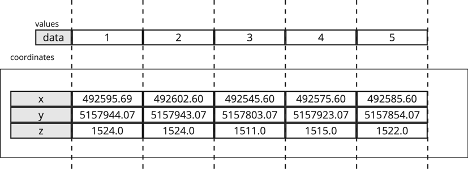
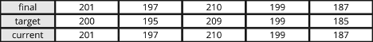
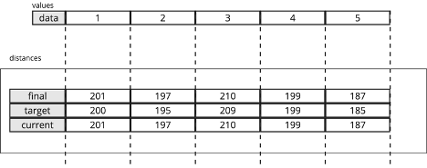
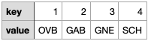

import OverlineWithVersion from '@theme/OverlineWithVersion';
import SchemaUri from '@theme/SchemaUri';
import FlatProperties from './generated/flatmd/objects/downhole-collection-1.3.0.md';

<OverlineWithVersion title="Geoscience Objects" version="1.3.0" badge="supported" />

# downhole-collection

<SchemaUri uri="schema/objects/downhole-collection/1.3.0/downhole-collection.schema.json" />

## Overview

### Objective

This documentation provides a comprehensive guide to the JSON schema for downhole collection geoscience objects. It is designed to assist both novice and experienced geoscientists in understanding, implementing, and troubleshooting JSON schemas for their downhole data.

### Background

The downhole collection geoscience object is meant to be used for a set of drill holes, not necessarily for individual drill holes. Each object is a snapshot of data at some point-in-time. The purpose of the downhole collection is to provide a flexible way to organize and store the data across a set of drill holes that would be used in some downstream workflow, like building a geological model.

### Scope

- Drill holes

### Audience

-	Developers
-	Geoscientists
-	GIS professionals

## Schema structure

The JSON schema for downhole collection geoscience objects is structured to capture essential data elements relevant to downhole data. Below is a high-level overview of the schema structure:

- Base Object Properties – The root component for all geoscience objects containing common attributes such as name, description, and a unique identifer.
- Base Spatial Data Properties – A set of properties common to all spatial objects such as bounding box and coordinate reference system.
- Location – The geographic reference of each drill hole in the downhole collection, described in XYZ notation (northing, easting, elevation). The XY coordinates (northing, easting) should be relative to the coordinate reference system defined in the base spatial data properties.
- Path – The trajectory of each drill hole in the downhole collection from the “top” of the hole to the “bottom” of the hole. The path is represented by a series of depth, azimuth, and dip values along the course of the drill hole. This is the raw survey data that is typically used in a desurveying algorithm to compute the geometry of the drill hole in three-dimensional space.
- Collections – The downhole data stored in a series of related collections. Each collection is made up of attributes that are related to an interval or depth. Collections are analogous to Tables in a database and attributes are analogous to columns in a table.
- Metadata – Information about the schema version, data source, units, and other metadata.

<FlatProperties />

::mermaid[generated/uml/downhole-collection-1.3.0.mmd]

## Schema definitions

NOTE: To keep things simple, only the required properties are defined. For a full list of available properties, refer to the individual component schemas.

### Base spatial data properties

|   Property	|   Value | Example |
| ------------- | ------- | ------- |
|   name	    |   The human-readable name of the downhole collection object. This is the value that users will see when they browse an Evo workspace or list out objects through the Evo API.	 | `"Summer 24 Drill Program"` |
|   uuid	    |   The universally unique identifier of the downhole collection object. 	|   `dd037871-4279-4954-bd43-3ead9d40a56e`    |
| bounding_box	|   The geographic bounds of the drill hole locations contained in the downhole collection object. This is used for spatial search in the Evo web portal.   | `{"min_y": 0, "max_y": 10, "min_x": 0, "max_x": 10, "min_z": 0, "max_z": 10}` |
|   coordinate_reference_system |   The coordinate reference system (CRS) that all location data is in. This applies to the bounding box as well as the drill hole locations. See ["Common data types"](https://developer.seequent.com/docs/api/fundamentals/common-data-types/#coordinate-reference-systems) for more information.   |   `{"epsg_code": 32617}` |

## Downhole collection properties

|   Property	| Value | Example |
| ------------- | ------- | ------- |
|   schema        |   The specific version of the schema that the downhole collection object will use. This will be used by the Geoscience Object Service to validate the properties of the object.	|   `"/objects/downhole-collection/1.2.0/downhole-collection.schema.json"` |
|   type    |	The geoscience object type. For downhole collection objects, this should be set as “downhole”.  |	`"downhole"` |
|   distance_unit   |	The unit of measure that all depth values are in. This applies to all depth/from/to values across all collections.  |	`"m"` |

### Location

|   Property	|   Value |
| ------------- | ------- |
|   coordinates |	The geographic location of each drill hole in the downhole collection. Each location is represented as X, Y, Z values (northing, easting, elevation). The coordinates array has 3 columns appropriately named “x”, “y”, and “z” and each value is a float. The row index where the coordinates appear in the array must match the row index where the drill holes appear in the hole_id property. For example, the values at index 4 of the coordinates array are the coordinates for the drill hole at index 4 in the hole_id array.   |
|   distances   |   The depth values of each drill hole in the downhole collection. The columns are “final”, “target”, and “current”. These are the final/target/current depth values for every drill hole. Each depth value is a float and the row index in the distances must match the row index of the hole_id array.   |
|   hole_id |   A category attribute that provides the main index order for the drill holes in the downhole collection. Category attributes are made up of a table and values. The values represent the index order of each drill hole and provide the main lookup for other attributes or properties. Each drill hole is represented by an integer index value, and the actual drill hole string value is included in the lookup table.    |
|   path    |   The trajectory of each drill hole in the downhole collection. The columns are “distance” (for depth), “azimuth”, and “dip”. This is the raw downhole survey data. There is no reference to the hole id directly, this is handled by the holes property that provides the offset and count of rows for each drill hole.  |
|   holes   |	The row offset and counts for the drill hole path data. Each drill hole in the downhole collection appears once, using the hole index provided by the hole_id lookup. The offset is the starting row for each drill hole, and the count is the number of rows for each drill hole.  |

#### Location example

As a detailed example, let’s say you have 5 drill holes that you wish to include in a downhole collection object. A good starting point would be to first establish the `hole_id` attribute, which provides the indexes and lookup for all subsequent properties.
The `hole_id` table is a key : value pair where the key is some unique identifier and the value is the actual drill hole identifier. This is the main lookup table for the hole IDs and provides a more efficient storage model for large datasets. The key established here will be used across various properties in the downhole collection as a sort of normalization of the data. The lookup table would look something like this:

The `hole_id` values establish the index (or order) that data in other properties will appear. Using the keys used in the lookup table, the values would look like this:

The drill hole with a key of [1] (which resolves to “DH-01”) is at index [0], drill hole [2] (which resolved to “DH-02”) is at index [1], etc.

With this index order established, we can now populate some of the other properties. The coordinates would then look like this:

Remember: the coordinates should be in the coordinate system established by the base `coordinate_reference_system` property.

Using the key indexes, we know which coordinate values are for which drill holes:

Where the coordinates at index [0] are the coordinate values for the drill hole at index [0] in the values array, which is the drill hole with a key of [1], which resolves to “DH-01”.

We can also populate the drill holes distances properties using the same index/order:

Where the distances at index [0] are the depth values for the drill hole at index [0] in the values array, which is the drill hole with a key of [1], which resolves to “DH-01”.

For the drill hole path, there could be multiple rows for each drill hole, so a single index will not apply. The path data for multiple drill holes would look like:

Remember: the distance values should be in the unit of measure established by the base ”distance_units” property.

Remember: the dip convention adopted by the Geoscience Object Service is that “positive dip points down”. Make sure your dip values honour this convention.

The holes array will then provide the instructions how to locate the data for each drill hole, based on the following logic:

The data for the drill hole with hole index [1], which resolves to ”DH-01“ based on the lookup, starts at index 0 of the path array and goes for a count of 5. The data for DH-02 (drill hole [2]) starts at index 5 and goes for a count of 5, and so on.

The final holes values would then be:

This provides all the logic required to marry the various attributes back to the drill hole IDs.

### Collections

The main collections to choose from are “interval” and “distance”. The difference between them is whether the data is based on a from/to (interval) or a single depth (distance) value.

NOTE: There are other collection options for specific scenarios (e.g. structures), but these will not be described here. Please refer to the schema for additional information on the other collection types.

Both the interval and distance collections are made up of 3 main components:

- The from-to interval values (for interval) OR the distance values (for distance)
- The attributes (the columns) related to the intervals/depths
- The index/offset/counts, like the path, that provides the instructions how to parse out the data and link it to the drill holes in the collection

#### Collection example

Let’s use a simple Lithology table as an example, something like this:

This would be an “interval_table” collection as it is based on from/to intervals.

The first step is to break out the from-to values into their own array, with appropriately named columns “from” and “to”:

Next is to break out each column as a separate attribute. In this example, the attribute columns are “Rock Type” and “Grain Size”. In this case, both attributes would be considered “category” attributes – because they can both be normalized to a lookup table.

NOTE: There many attribute types to choose from, depending on the data type (boolean, date, string, integer, etc.). For more details on how attributes work in general [see "Understanding attributes".](../understanding-schemas/understanding-attributes.md)

If we isolate the “Rock Type” attribute:

First, we normalize this to create the lookup table. This is a distinct list of all values, with some unique identifiers. The lookup is provided as a key : value pair. The lookup for the example above would appear as:

The values for the Rock Type attribute are then substituted with the keys above:

Each attribute needs to be isolated and populated similar to the above example.

Once all attributes are populated, the last step for the collection is to provide the “holes” property, which is the index/offset/count to identify what rows belong to each drill hole.

The holes property for the example table would then be:

Where rows for drill hole with index [1] (that resolves to “DH-01” based on the main drill hole lookup) starts at [0] and goes for a count of [4]. The rows for drill hole [2] (“DH-01”) start at index [4] and goes for a count of [3], etc.

There is only one holes property for the collection, as each attribute/column is based on the same from/to interval rows.

These steps need to be repeated for each table that is part of the downhole collection. Every table needs to be defined as an appropriate collection type, each set of from/to (or depth) needs to be isolated for each collection, and each column needs to be isolated for each collection.

## Troubleshooting common validation errors
Common validation errors and their solutions:

- Error: "Required field missing" - Ensure that all required fields are present in the JSON object.
- Error: "Invalid data type" - Check that the data types of the fields match the schema definition.
- Error: "Out of range value" - Verify that numerical values are within the acceptable range defined in the schema.

## Glossary of key terms

- JSON - JavaScript Object Notation, a lightweight data interchange format.
- Schema - A structured framework for defining the format and content of data.
- Geoscience - The scientific study of the Earth, including its composition, structure, and processes.
- Component
- Element
- Object
- Spatial Object
- Bounding Box
- Coordinate Reference System (CRS)
- Parquet File

## Use-case scenario

Consider a research team collecting rock samples from various locations. They can use the JSON schema to standardize the recording of sample data, ensuring that all relevant attributes are captured uniformly. This standardized data can then be shared with other researchers or integrated into a central database for further analysis.
