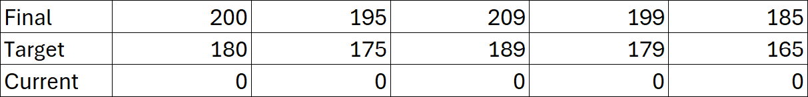
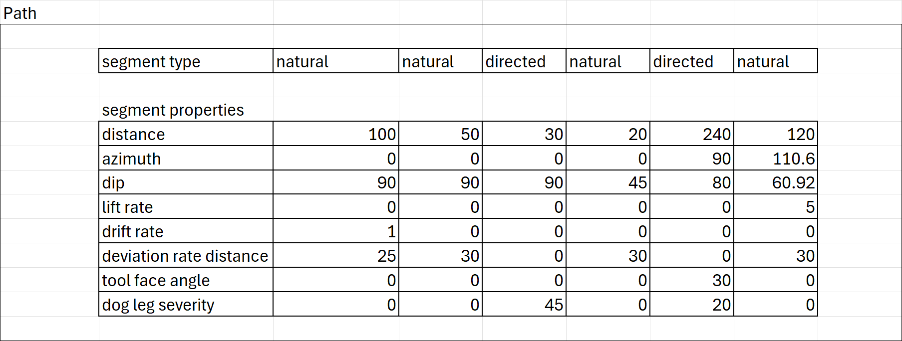

import SchemaUri from '@theme/SchemaUri';
import FlatProperties from './_generated/flatmd/objects/drilling-campaign-1.0.0.md';

# drilling-campaign

<SchemaUri uri="schema/objects/drilling-campaign/1.0.0/drilling-campaign.schema.json" />

## Overview

### Objective

This documentation provides a comprehensive guide to the JSON schema for drilling campaign geoscience objects. It is designed to assist both novice and experienced geoscientists in understanding, implementing, and troubleshooting JSON schemas for their drilling data.

### Background

The drilling campaign geoscience object is meant to be used for a set of planned drillholes and their interim drilling results, not necessarily for individual planned drillholes. The purpose of the drilling campaign is to provide a flexible way to organize and store the data across a set of planned drillholes that would be used in production contexts like planning open pit mines, geothermal wells and geotechnical site investigations.

### Scope

- Planned drillholes

### Audience

-	Developers
-	Geoscientists
- Mine planning professionals
- Geotechnical engineers

## Schema structure

The JSON schema for drilling campaign geoscience objects is structured to capture essential data elements relevant to planned drillhole data. Below is a high-level overview of the schema structure:

- Base Object Properties – The root component for all geoscience objects containing common attributes such as name, description, and a unique identifier.
- Base Spatial Data Properties – A set of properties common to all spatial objects such as bounding box and coordinate reference system.
- Planned – Properties relating to the planned drillholes, including the geometry and any expected attributes of the drillholes. The path of a planned drillhole can be defined in different ways depending on the drilling equipment to be used. 
- Interim – Properties relating to interim results from partially or fully drilled holes, including the geometry and any attributes on them. The trajectory of each drillhole in the interim drilling campaign data from the “top” of the hole to the “bottom” of the hole is represented by a series of depth, azimuth, and dip values along the course of the drillhole. This is the raw survey data that is typically used in a desurveying algorithm to compute the geometry of the drillhole in three-dimensional space.
- Metadata – Information about the schema version, data source, units, and other metadata.

The Planned and Interim drilling data have some common properties:
- Location – The geometry of each drillhole in the drilling campaign, described in XYZ notation (northing, easting, elevation). The XY coordinates (northing, easting) should be relative to the coordinate reference system defined in the base spatial data properties.
- Distances – The final, target and current length of the drillhole, measured along the drillhole. The final distance should be the target distance plus an option extension. These values should be given in the units specified by metadata depth unit.
- Collections – The downhole data stored in a series of related collections. Each collection is made up of attributes that are related to an interval or depth. Collections are analogous to Tables in a database and attributes are analogous to columns in a table.

<FlatProperties />

::mermaid[_generated/uml/drilling-campaign-1.0.0.mmd]

## Schema definitions

NOTE: To keep things simple, only the required properties are defined. For a full list of available properties, refer to the individual component schemas.

### Base spatial data properties

|   Property	|   Value | Example |
| ------------- | ------- | ------- |
|   name	    |   The human-readable name of the drilling campaign object. This is the value that users will see when they browse an Evo workspace or list out objects through the Evo API.	 | `"Summer 24 Drill Program"` |
|   uuid	    |   The universally unique identifier of the drilling campaign object. 	|   `dd037871-4279-4954-bd43-3ead9d40a56e`    |
| bounding_box	|   The geographic bounds of the drillhole locations contained in the drilling campaign object. This is used for spatial search in the Evo web portal.   | `{"min_y": 0, "max_y": 10, "min_x": 0, "max_x": 10, "min_z": 0, "max_z": 10}` |
|   coordinate_reference_system |   The coordinate reference system (CRS) that all location data is in. This applies to the bounding box as well as the drillhole locations. See ["Common data types"](https://developer.seequent.com/docs/api/fundamentals/common-data-types/#coordinate-reference-systems) for more information.   |   `{"epsg_code": 32617}` |

## Drilling campaign properties

|   Property	| Value | Example |
| ------------- | ------- | ------- |
|   schema        |   The specific version of the schema that the drilling campaign object will use. This will be used by the Geoscience Object Service to validate the properties of the object.	|   `"/objects/drilling-campaign/1.0.0/drilling-campaign.schema.json"` |
|   type    |	The geoscience object type. For drilling campaign objects, this should be set as campaign.  |	`"campaign"` |
|   depth_units   |	The unit of measure that all depth values are in. This applies to all depth/from/to values across all collections.  |	`"m"` |
|   hole_id |   A category attribute that provides the main index order for both planned drillholes and their associated interim drilling data in the drilling campaign. Category attributes are made up of a table and values. The values represent the index order of each drillhole and provide the main lookup for other attributes or properties. Each drillhole is represented by an integer index value, and the actual drillhole string value is included in the lookup table.    |

### Planned

|   Property	|   Value |
| ------------- | ------- |
|   collar   | The information related to the physical location of the planned drillhole in 3d space and includes references to the path and collection table row indices for each segment. |
|   path    |   The trajectory of each drillhole in the drilling campaign. The columns required depend on the deviation type. There is no reference to the hole id directly, this is handled by the holes property that provides the offset and count of rows for each drillhole.|

#### Planned path (natural deviation)

|   Property  |   Value |
| ----------- | ------- |
| deviation type | The type of deviation used to define the segment geometry. Natural deviation uses lift and drift angles over a set distance to define the dogleg severity of each segment. |
| data | The columns are “distance” (length of the segment), "inclination", “azimuth”, “dip” (angle down from horizontal), "deviation rate distance" (The distance over which the given lift and drift rates occur), "lift rate", "drift rate". These are the parameters that define each segment of the planned drillhole. |

#### Planned path (mixed deviation)

|   Property  |   Value |
| ----------- | ------- |
| deviation type | The type of deviation used to define the segment geometry. Mixed deviation uses both natural and directed deviations to define the rate of change in  of each segment. |
| segment_type | A list to indicate which settings should be used for each segment either deviation rate distance, lift rate and drift rate for 'natural' or deviation rate distance, toolface angle and dogleg severity for 'directed'|
| segment_properties | The columns are “distance” (length of the segment), “azimuth”, “dip” (angle down from horizontal), "deviation rate distance" (The distance over which the given lift and drift rates occur), "lift rate", "drift rate", "toolface angle" (The direction of deviation clockwise from the top side of the drillhole), "dogleg severity" (The total angle change of the segment). These are the parameters that define each segment of the planned drillhole. |

### Interim

|   Property	|   Value |
| ------------- | ------- |
|   collar   | The information related to the physical location of the planned drillhole in 3d space and includes references to the path and collection table row indices for each segment. |
|   path    |   The trajectory of each drillhole in the drilling campaign. The columns are “distance” (length of the segment), "inclination", “azimuth”, “dip” (angle down from horizontal). These are the parameters that define each segment of the planned drillhole. There is no reference to the hole id directly, this is handled by the holes property that provides the offset and count of rows for each drillhole.|

### Collar
| Property | Value |
| ------------- | ------- |
|   locations |	The geographic location of each drillhole in the drilling campaign. Each location is represented as X, Y, Z values (northing, easting, elevation). The coordinates array has 3 columns appropriately named “x”, “y”, and “z” and each value is a float. The row index where the coordinates appear in the array must match the row index where the drillholes appear in the hole_id property. For example, the values at index 4 of the coordinates array are the coordinates for the drillhole at index 4 in the hole_id array.   |
|   distances   |   The total depth values of each drillhole in the drilling campaign. The columns are “final”, “target”, and “current”. These are the final/target/current depth values for every drillhole. Each depth value is a float and the row index in the distances must match the row index of the hole_id array.   |
|   holes   |	The row offset and counts for the drillhole path data. Each drillhole in the drilling campaign appears once, using the hole index provided by the hole_id lookup. The offset is the starting row for each drillhole, and the count is the number of rows for each drillhole.  |

#### Planned drillholes example

As a detailed example, let’s say you have 5 planned drillholes that you wish to include in a drilling campaign object. A good starting point would be to first establish the `hole_id` attribute, which provides the indexes and lookup for all subsequent properties.
The `hole_id` table is a key : value pair where the key is some unique identifier and the value is the actual drillhole identifier. This is the main lookup table for the hole IDs and provides a more efficient storage model for large datasets. The key established here will be used across various properties in the drilling campaign as a sort of normalization of the data. The lookup table would look something like this:

The `hole_id` values establish the index (or order) that data in other properties will appear. Using the keys used in the lookup table, the values would look like this:

The drillhole with a key of [1] (which resolves to “phase_001”) is at index [0], drillhole [2] (which resolved to “phase_002”) is at index [1], etc.

With this index order established, we can now populate some of the other properties. The coordinates would then look like this:

Remember: the coordinates should be in the coordinate system established by the base `coordinate_reference_system` property.

Using the key indexes, we know which coordinate values are for which drillholes:

Where the coordinates at index [0] are the coordinate values for the drillhole at index [0] in the values array, which is the drillhole with a key of [1], which resolves to “DH-01”.

We can also populate the drillhole distances properties using the same index/order:

Where the distances at index [0] are the depth values for the drillhole at index [0] in the values array, which is the drillhole with a key of [1], which resolves to “phase_001”.

Remember: the distance values should be in the unit of measure established by the base "depth_units" property.

Remember: the dip convention adopted by the Geoscience Object Service is that “positive dip points down”. Make sure your dip values honour this convention.

The holes array will then provide the instructions how to locate the data for each drillhole, based on the following logic (For a mixed deviation path):

The data for the drillhole with hole index [1], which resolves to ”phase_001“ based on the lookup, starts at index 0 of the path array and goes for a count of 1. The data for phase_002 (drillhole [2]) starts at index 1 and goes for a count of 3, and so on.

This provides all the logic required to marry the various attributes back to the drillhole IDs.

### Collections

The main result collections to choose from are “interval” and “distance”. The difference between them is whether the data is based on a from/to (interval) or a single depth (distance) value.

NOTE: There are other collection options for specific scenarios (e.g. structures), but these will not be described here. Please refer to the schema for additional information on the other collection types.

Both the interval and distance collections are made up of 3 main components:

- The from-to interval values (for interval) OR the distance values (for distance)
- The attributes (the columns) related to the intervals/depths
- The index/offset/counts, like the path, that provides the instructions how to parse out the data and link it to the drillholes in the campaign

### Interim

The properties of interim drilling data are substantially the same as those of planned drillholes, with the only difference being the path description and choice of desurvey method.

|   Property	|   Value |
| ------------- | ------- |
|   collar |	The geographic location of each drillhole in the drilling campaign. Each location is represented as X, Y, Z values (northing, easting, elevation). The coordinates array has 3 columns appropriately named “x”, “y”, and “z” and each value is a float. The row index where the coordinates appear in the array must match the row index where the drillholes appear in the hole_id property. For example, the values at index 4 of the coordinates array are the coordinates for the drillhole at index 4 in the hole_id array.   |
|   path    |   The trajectory of each drillhole in the drilling campaign. The columns are “distance” (length of the segment), “azimuth”, “dip” (angle down from horizontal). This is the raw downhole survey data. There is no reference to the hole id directly, this is handled by the holes property that provides the offset and count of rows for each drillhole.|
|   desurvey   |The desurvey method used to calculate the drillhole geometry. Available options are "minimum_curvature", "balanced_tangent" and "trench".|

## Troubleshooting common validation errors
Common validation errors and their solutions:

- Error: "Required field missing" - Ensure that all required fields are present in the JSON object.
- Error: "Invalid data type" - Check that the data types of the fields match the schema definition.
- Error: "Out of range value" - Verify that numerical values are within the acceptable range defined in the schema.

## Glossary of key terms

- JSON - JavaScript Object Notation, a lightweight data interchange format.
- Schema - A structured framework for defining the format and content of data.
- Geoscience - The scientific study of the Earth, including its composition, structure, and processes.
- Component
- Element
- Object
- Spatial Object
- Bounding Box
- Coordinate Reference System (CRS)
- Parquet File
