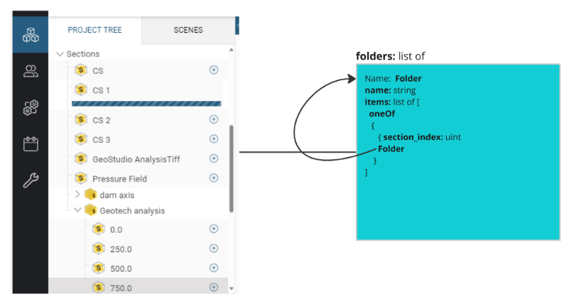
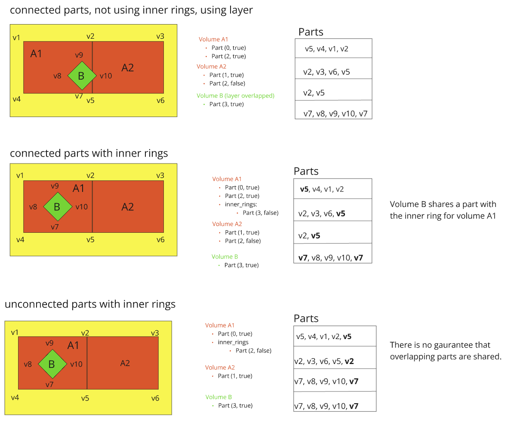

import OverlineWithVersion from '@theme/OverlineWithVersion';
import SchemaUri from '@theme/SchemaUri';
import FlatProperties from '../generated/flatmd/objects/geological-sections-1.2.0.md';

<OverlineWithVersion title="Geoscience Objects" version="1.2.0" badge="supported" />

# geological-sections

<SchemaUri uri="schema/objects/geological-sections/1.2.0/geological-sections.schema.json" />

**Key components:**
- [embedded-line-geometry](../components/embedded-line-geometry.md) — Polylines composed of straight line segments
- [embedded-polyline-object](../components/embedded-polyline-object.md) — Named polyline/polygon parts within line geometry
- [material](../components/material.md) — Material properties including name, colour, and data source

**See also:** [geological-model-meshes](geological-model-meshes.md) (mesh-based modelling).

## Overview

The geological-sections schema is used to store geology as a set of planar cross sections. Soil layers and volumes are represented using 2D line segments on the section plane. This object does not support curved or crooked sections. Only geology and its associated properties are expected in a geological-sections object.

## `folders` *array*

A recursive list of folders containing indices into the sections list. The folders give organizational structure to the set of cross sections stored in this object.

E.g.

  

## `sections` *array*

A list of planar cross sections. Each cross section contains a set of volumes and surfaces.

* `name` - Section name.

* `description`  - Optional field for adding additional description about this object.

* `origin` - The coordinates of the section origin. [x, y, z].

* `Rotation` Section [Rotation](../components/rotation.md) in model space.

### `volumes` *array*

A list of polygon volumes. Each volume consists of one or more connected polyline parts which together represent a closed polygon (a ring). Holes in a volume can optionally be represented using a set of internal rings, where each ring is a non-intersected hole in the volume. Holes can also be represented using an overlapping volume in a different layer.

* `name` : Volume name

* `description` : Optional additional description.

* `parts` : Array of polyline [parts.](../../understanding-schemas/understanding-parts.md) The entire array of parts creates a closed polygon. Each entry is a pair of values - an `index` to a line_geometry [chunk](#line_geometry) which represents a sequence of line segments, and a `reversed` flag. The same chunk can be used for directed traversal by different volumes, surfaces, or both.

* `material_key`: Unique identifier to a material in the materials list. 

* `feature`: Kind of geology feature represented by this volume. Can be one of
  - "Void"
  - "OutputVolume"
  - "Vein"
  - "VeinSystem"
  - "Generic"

* `layer` : Optional layer containing the polygon. Polygons in the same layer should not overlap. Polygons in different layers can overlap.

* `internal_rings`: Optional field representing internal rings (holes) inside the volume. When multiple inner rings exist they can touch but should not overlap. Inner rings should not extend outside the volume boundary.

### volume_attributes

Attributes associated with each volume. Attribute tables have one row per volume.

### `surfaces` *array*

A list of polyline surfaces. Each surface consists of one or more connected polyline parts. 

* `name` : Surface name

* `description` : Optional additional description.

* `parts` : Array of polyline [parts.](../../understanding-schemas/understanding-parts.md) Each entry is a pair of values — an `index` to a line_geometry [chunk,](#line_geometry) which represents a sequence of line segments, and a `reversed` flag. The same chunk can be used for directed traversal by different volumes, surfaces, or both.

* `material_key`: Unique identifier to a material in the materials list. 

* `feature`: Geology feature represented by this volume. Can be one of
  - "Fault"
  - "ContactSurface"
  - "Topography"
  - "BoundarySurface"
  - "StratigraphicContactSurface"
  - "Generic"

* `layer` : Optional layer containing the surface. 

### `surface_attributes` *../components/one-of-attribute-1.2.0*

Attributes associated with each polyline surface. The attribute tables have one row per surface.

### `line_geometry`

Container of chunks of vertices. Each volume/surface [part](../../understanding-schemas/understanding-parts.md) references a chunk of vertices to represent a collection of connected line segments. A given part may or may not be shared between adjacent volumes and surfaces. Storing a connected geometry using shared parts is preferred but not guaranteed as it depends on information available to the producer when the object is created. When unconnected, line segments in one part may overlap line segments in another part. 

* `vertices` Table of u,v (local x,y) coordinates on the section. 

* `indices` Optional table of indices to vertices. This table exists to support parts that contain a non-contiguous collection of vertices. If this table is empty chunks point directly to the vertices table.

* `chunks` Part chunks. Each entry in this table is an offset/count pair that represents a sequence of vertices in a part. Two storage schemes are supported:

If indices are missing (contiguous case):
- Each chunk is an offset/count directly into the vertices table.

If indices are defined
- Each chunk is an offset/count into the indices table which in turn points to vertices. 

### `materials` *array*

[Materials](../components/material) associated with volumes or surfaces. 

### `layer_order` *array*

An optional list of layers used when stacking volumes to remove ambiguity about the geometric interpretation of layered volumes. Layers are occluded sequentially from top to bottom. The first layer in the array is considered the topmost layer, followed with the next layer below the first and so on finally concluding with the bottommost layer in the last entry.

For example consider 3 volumes each on their own layer A, B, C. Without additional information the geology is ambiguous as each the following cases are valid:

  Adding a layer_order (C-B-A) to the object disambiguates which interpretation of the geology to use.

## Various Representations using Parts

Volumes A1, A2 with overlapping volume B. All of the following representations are valid:

## Properties

<FlatProperties />

::mermaid[../generated/uml/geological-sections-1.2.0.mmd]
