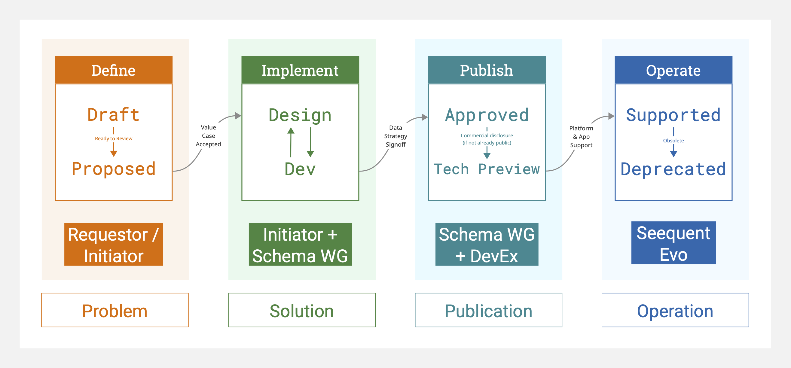

# Schema Development Lifecycle

The development of new Geoscience Object Schemas is a critical part of how Seequent Evo continues to evolve to support the Geoscience community. The present set of schemas will *always* have some gaps, as the range of data types and techniques within the geosciences is always growing.

Here, we describe the process that (depending on decisions made along the way) may lead to the development and release of a new schema.

<Alert severity="info">
#### A note on secrecy

Seequent is a part of Bentley Systems, a publicly-traded company listed on the NASDAQ stock exchange. As with all large companies, and especially publicly-traded companies, there are internal rules and international laws that govern the disclosure of certain information. Sometimes, the development of a new schema might represent this kind of disclosure (for example, it might signal a move into a new market segment or an integration with a new partner).

While we *always* prefer to develop these schemas in the open, there will be circumstances where some of the steps outlined below are *not* publicly visible.

Responsible commercial disclosure is a necessary step before a schema enters **Tech Preview** (see below). In the (most common) situation wherein a schema is developed fully in the open, there is functionally no difference between **Approved** and **Tech Preview**.
</Alert>

## Process

### Problem

The first step is to define the "problem to solve". This might come from a Seequent partner or customer (*that could be you*), from feedback Seequent has received, or from a new product need or idea we surface internally. Wherever possible, the *best* place to define the problem is in a public RFC (Request for Comment; see [Open source](https://developer.seequent.com/docs/guides/open-source)).

<Alert severity="info" actionText="See active RFCs" actionLink="https://github.com/SeequentEvo/evo-schemas/issues">
You can see the active RFCs on the `SeequentEvo/evo-schemas` GitHub repository—they're all issues of type `rfc`. This is also where you can go to *create a new RFC*.
</Alert>

Once an RFC has been created, the maintainers of the [`SeequentEvo/evo-schemas`](https://github.com/SeequentEvo/evo-schemas) repository will work with the submitter to help characterize the problem. Depending on the scope of the work, the submitter or maintainers may solicit input from other parties, and this conversation happens on the RFC discussion thread (where possible).

Often (but not always), it will happen that the problem can be solved with one or more new schemas, or with an enhancement to an existing schema. A conversation needs to be had that establishes that there is sufficient Value to be had. This comes down to interest in the schema relative to the resources available—i.e., making sure there is capacity to get the work done in a reasonable time. In that event, the Seequent team would accept the Value Case (internally, this would be a Business Case) and the next step is **Solution** definition.

### Solution

The **Solution** phase is all about figuring out the best way to solve the problem defined above. Once the Value Case is accepted, the Schema Working Group (which includes maintainers of the schema repository) will work with the submitter to co-develop a solution. This may mean the creation of one or more schemas.

The process has been designed to make it as easy as possible for submitters who come with capacity to help do the work—including, but not limited to the case where the submitter is a Seequent Product Manager and the work is done by Seequent employees. In this case, the Schema Working Group will work along with the developers to guide the schema development process and fit it into the overall set of schemas. This might include work like recommending where to break shared capabilities out into a Component.

In the event there is a request for a new schema but no capacity to build it, the RFC might not be accepted into the **Solution** phase at all; or, work might pause or halt entirely. This doesn't mean it's a bad idea, nor does it mean it won't be worked on at all—however, capacity is limited. Wherever possible, we will communicate clearly about these decisions.

### Publication

The **Publication** phase tracks the schema as it makes its way to being publicly available. In the event that a schema has been developed in private, it must be disclosed commercially for it to enter the **Tech Preview** state. Functionally, a schema that is in **Tech Preview** is fully usable within the running instances of the [Geoscience Objects API](https://developer.seequent.com/docs/api/geoscience-object/geoscience-object-api). This enables development against the schema by any Evo user (including Seequent developers, customers and partners).

For schemas in **Tech Preview**, no Service Level Agreements (SLA) or Deprecation guarantees apply.

Customers and partners should expect that Seequent products have mixed support for schemas in this state—part of the purpose is to give teams a chance to build against the schema, and this includes Seequent / Bentley internal teams. For example, common features like visualization might not work yet for schemas in **Tech Preview**, even if it seems like an obvious feature. Mature products might not be able to read or write the schema.

**Tech Preview** schemas are marked as such in the Developer Portal, and that is the authoritative place to check the status of a schema you wish to use.

### Operation

For schemas that are fully **Supported**, the usual Evo SLAs and Deprecation policy apply. That doesn't mean they are supported everywhere (which schemas are supported depends on the product and workflow).

Sometimes, a **Supported** schema might no longer be useful (perhaps it has been superseded or didn't receive sufficient uptake in products). In that situation, the schema will enter the **Deprecated** state, which means we recommend that it not be used for new integrations.

In the event that a schema is **Deprecated**, Seequent will communicate any proposed changes to the support, including a clear estimate of when and how anything might change.